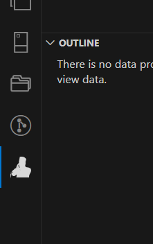

# muadzin-reminder README
 
## Task

- Init vscode extension
- Create temporary UI for testing ui compatibility
   - create action and tree button     ``✅ done``  

     
   
   - Create webview    ``✅ done``               
   - Build express server ``✅ done``  
   - Build Vue.js infrastructure (http static, vue3-sfc-loader, etc) ``✅ done``  

- testing pray time library
- Build UI
- Deploy