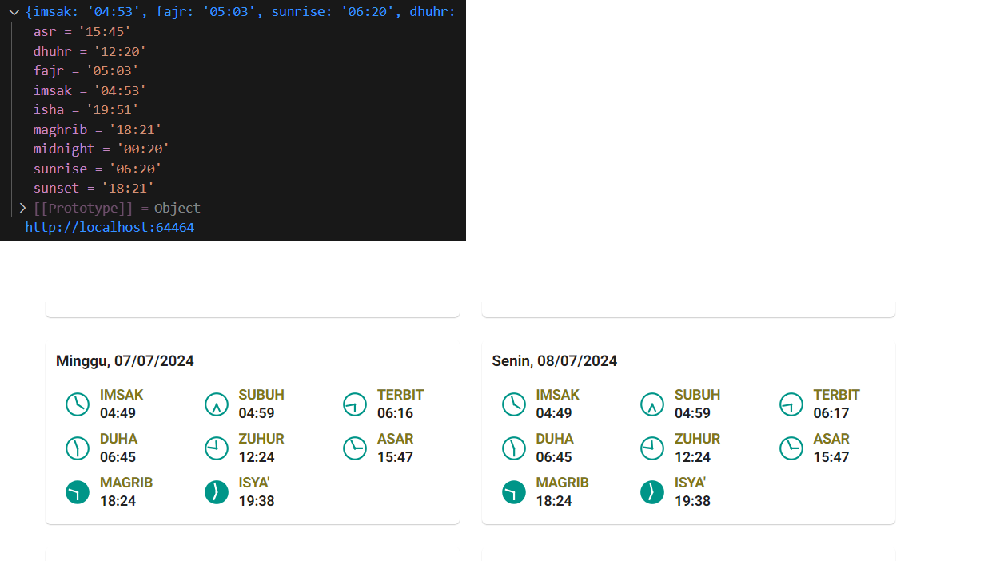

# muadzin-reminder README

# Catatan Developer

Cara Deploy
 - Build Vite Masuk di folder MuadzinUi
 
## Task

- Init vscode extension
- Create temporary UI for testing ui compatibility
   - create action and tree button     ``✅ done``  

     
   
   - Create webview    ``✅ done``               
   - Build express server ``✅ done``  
   - Build Vue.js infrastructure (http static, vue3-sfc-loader, etc) ``✅ done``  

- testing pray time library
  - convert to export typescript ``✅ done``  
  - test run ``✅ done``  

  

- Build UI
- Deploy